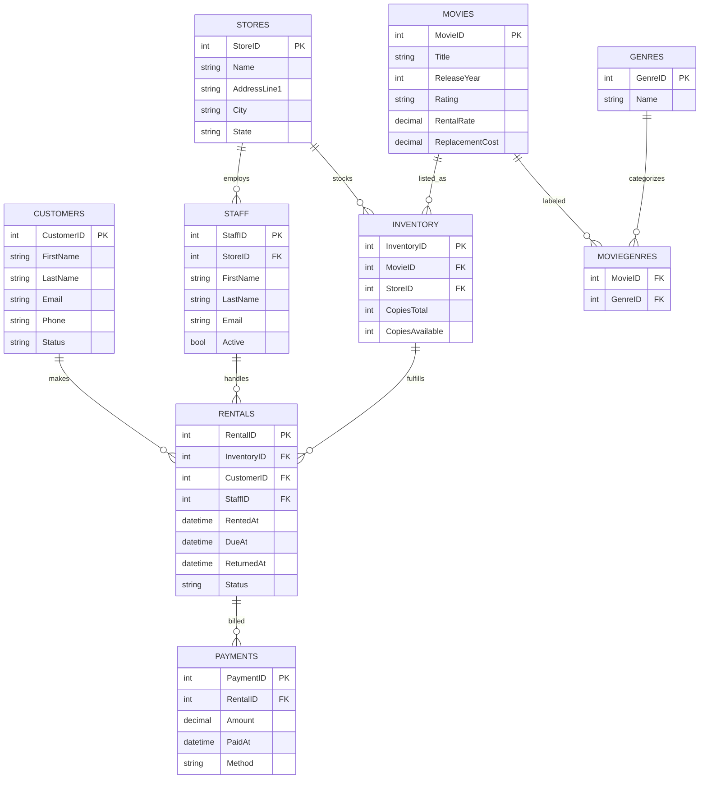

# 🎬 Movie Rental System

  

A Dockerized Microsoft SQL Server database for a classic movie rental domain—customers, movies, inventory, rentals, and payments—with seed data, views, procs, and triggers.

## 🗺️ ER Diagram (Mermaid)

## 🚀 Quick start  
1. Create .env with `SA_PASSWORD`
1. `docker compose -f docker/docker-compose.yml up -d`
1. Apply scripts: `sqlcmd -i scripts/apply.sql` via container (see scripts section)
1. Try `RentMovie` / `ReturnMovie` to validate logic.

## 📂 Structure  
- `docker/` compose & runtime  
- `sql/` DDL, views, procs, triggers, seed  
- `scripts/` orchestration `.sql`  
- `data/` CSVs (future)

## 🔧 Scripts  
Use `scripts/apply.sql` to apply in correct order.

## 📝 License  
MIT — see LICENSE.
